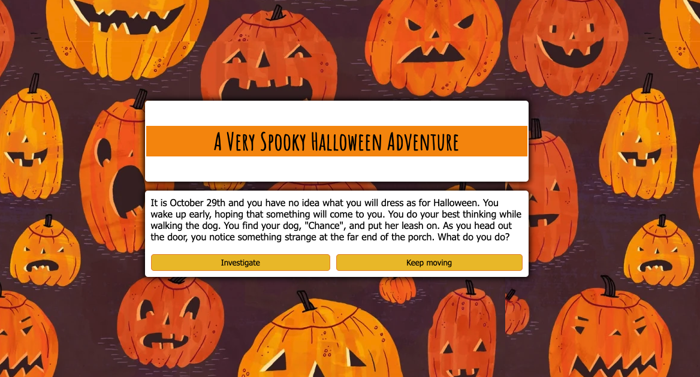

# Spooky Adventure

I love all kinds of storytelling, but spooky stories hold a special place in my heart! Because it's October as I work on this Stackathon project, I decided to try to incorporate my love of spooky stories with my interest in educational technology. My goals were to use JavaScript, to practice some interesting CSS, and to create an app that would be downloadable.   
During Stackathon, I spent a lot of time thinking about educational resources. As a starting point, I attended the Grace Hopper Celebration's Open Source Day and worked on contributing to the open educational resources provided by Curriki. Unfortunately, after I had spent time finding the place in the code where I needed to make changes, there was something about my setup that the mentors said wouldn't work with the project because of my operating system. I plan to go back if I get the chance to set up my Raspberry Pi and attempt to contribute once again because during my time as an educator, I used and curated many OERs (open educational resources) and I value the community that makes them available.
  
I went on to think about two things:  
1. What ways can I share stories that would be interactive and entertaining for a K-6 audience?
2. How can I support the need for electronic resources that are available on and off the web? This is an important question for me because I have seen first hand how challenging the prospect of accessible educational technology can be in a rural area with limited access to broadband internet. My ideal educational resource would be one that is available as a web application, but can also be downloaded to a machine and used offline, later.

I spent some time working on a mad-libs generator and ended up at a point where I had to put that on the back burner, because I was having a hard time deciding how to insert the form information (dynamically generated by a list of blanks to fill in) into a body of text.

I'll share a screenshot of the header section because I was so excited with the experimentation I had done using CSS. The menu items actually have an animated glowing effect that I thought was very cute! I also spent some time figuring out the best way to incorporate Google Fonts, thought I may not have ended up using the best font from a design perspective. Trust me, the kids will like it!  

My next thought was to try a very simple text-based choose-your-own-adventure game and then package that in an electron app, which is donwloadable.

I'm mostly done with building this, and it is a very simple app. It runs in the browser window in the same way a website would, but you can also package it for use as a desktop app on various operating systems. My next step is to look into a tool called Bulma (a CSS framework) to make a more polished UI for the desktop.

Also, use Electron Forge for packaging. https://www.electronjs.org/docs/tutorial/quick-start